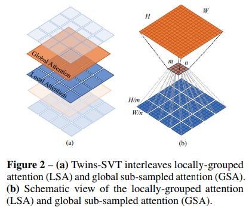

## Twins SVT

</img>

"Very recently, a variety of vision transformer architectures for dense prediction tasks have been proposed and they show that the design of spatial attention is critical to their success in these tasks. In this work, we revisit the design of the spatial attention and demonstrate that a carefully-devised yet simple spatial attention mechanism performs favourably against the state-of-the-art schemes. As a result, we propose two vision transformer architectures, namely, Twins-PCPVT and Twins-SVT. Our proposed architectures are highly-efficient and easy to implement, only involving matrix multiplications that are highly optimized in modern deep learning frameworks. More importantly, the proposed architectures achieve excellent performance on a wide range of visual tasks, including image level classification as well as dense detection and segmentation. The simplicity and strong performance suggest that our proposed architectures may serve as stronger backbones for many vision tasks." - Xiangxiang Chu, Zhi Tian, Yuqing Wang, Bo Zhang, Haibing Ren, Xiaolin Wei, Huaxia Xia, Chunhua Shen

### Research Paper:
- https://arxiv.org/abs/2104.13840

### Official repository:
- https://github.com/Meituan-AutoML/Twins

### Usage:
```python
import numpy

key = jax.random.PRNGKey(0)

img = jax.random.normal(key, (1, 224, 224, 3))

v = TwinsSVT(
    num_classes = 1000,       # number of output classes
    s1_emb_dim = 64,          # stage 1 - patch embedding projected dimension
    s1_patch_size = 4,        # stage 1 - patch size for patch embedding
    s1_local_patch_size = 7,  # stage 1 - patch size for local attention
    s1_global_k = 7,          # stage 1 - global attention key / value reduction factor, defaults to 7 as specified in paper
    s1_depth = 1,             # stage 1 - number of transformer blocks (local attn -> ff -> global attn -> ff)
    s2_emb_dim = 128,         # stage 2 (same as above)
    s2_patch_size = 2,
    s2_local_patch_size = 7,
    s2_global_k = 7,
    s2_depth = 1,
    s3_emb_dim = 256,         # stage 3 (same as above)
    s3_patch_size = 2,
    s3_local_patch_size = 7,
    s3_global_k = 7,
    s3_depth = 5,
    s4_emb_dim = 512,         # stage 4 (same as above)
    s4_patch_size = 2,
    s4_local_patch_size = 7,
    s4_global_k = 7,
    s4_depth = 4,
    peg_kernel_size = 3,      # positional encoding generator kernel size
    dropout = 0.              # dropout
)

init_rngs = {'params': jax.random.PRNGKey(1), 
            'dropout': jax.random.PRNGKey(2)}

params = v.init(init_rngs, img)
output = v.apply(params, img, rngs=init_rngs)
print(output.shape)

n_params_flax = sum(
    jax.tree_leaves(jax.tree_map(lambda x: numpy.prod(x.shape), params))
)
print(f"Number of parameters in Flax model: {n_params_flax}")
```

### Citation:
```bibtex
@article{DBLP:journals/corr/abs-2104-13840,
  author    = {Xiangxiang Chu and
               Zhi Tian and
               Yuqing Wang and
               Bo Zhang and
               Haibing Ren and
               Xiaolin Wei and
               Huaxia Xia and
               Chunhua Shen},
  title     = {Twins: Revisiting Spatial Attention Design in Vision Transformers},
  journal   = {CoRR},
  volume    = {abs/2104.13840},
  year      = {2021},
  url       = {https://arxiv.org/abs/2104.13840},
  eprinttype = {arXiv},
  eprint    = {2104.13840},
  timestamp = {Thu, 12 Aug 2021 15:37:12 +0200},
  biburl    = {https://dblp.org/rec/journals/corr/abs-2104-13840.bib},
  bibsource = {dblp computer science bibliography, https://dblp.org}
}
```